<p align="center">
  
</p>

<h1 align="center">Todoer</h1>

<p align="center">
  A full-featured, offline-first task management desktop app inspired by Todoist.<br />
  Built with Electron, React, and SQLite — your data stays on your machine.
</p>

<p align="center">
  
  
  
  
</p>

<p align="center">
  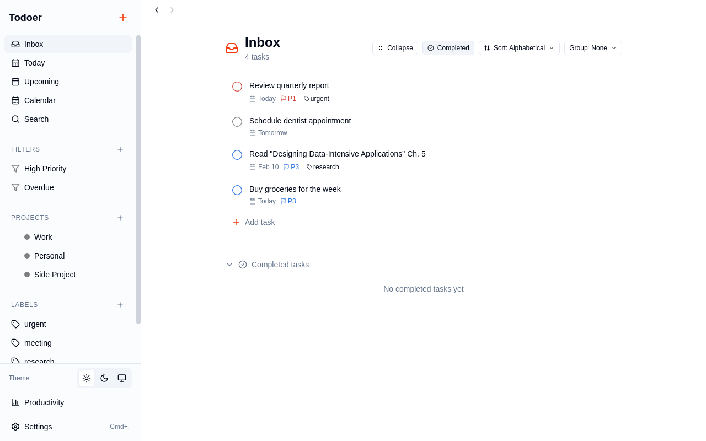
</p>

---

## Highlights

- **Offline-first** — all data stored locally in SQLite, no account required
- **Todoist-inspired UI** — priorities (P1–P4), projects, labels, sections, and filters
- **Keyboard-first** — 30+ shortcuts for power users, press `?` to see them all
- **Natural language input** — `"meeting tomorrow #Work @urgent p1 for 30 min"`
- **Multiple views** — Today, Upcoming, Calendar, Board/Kanban, Search
- **MCP server** — integrate with AI assistants like Claude Code
- **Dark mode**, import/export, recurring tasks, subtasks, comments, and more

---

## Screenshots

### Inbox

Organize tasks with priorities (P1–P4), due dates, labels, and project assignments. Tasks are color-coded by priority level.


### Today View

Focus on what matters. See tasks due today, overdue items, and their subtasks at a glance.

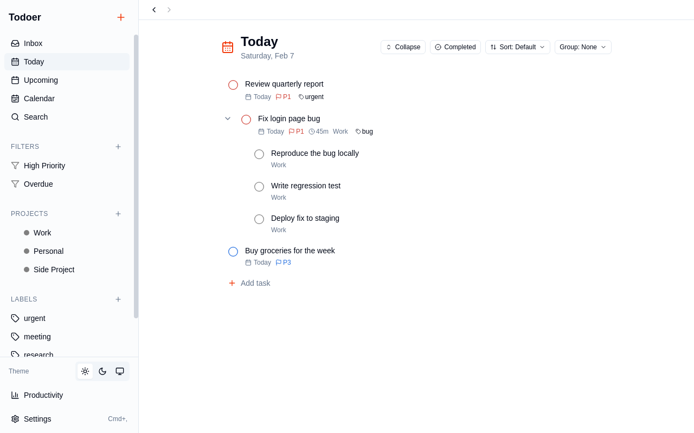

### Quick Add

Press <kbd>Q</kbd> to add tasks instantly. Supports inline parsing for projects, labels, priority, and duration.

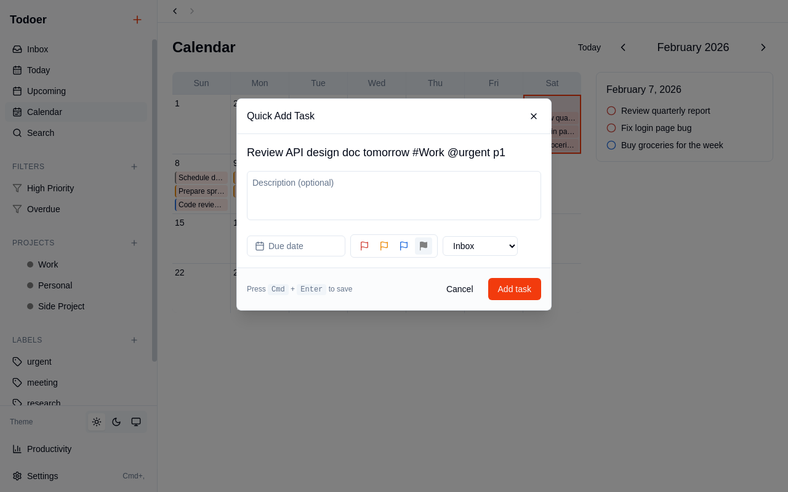

### Task Details

Rich editing with descriptions, labels, due dates, deadlines, duration tracking, subtasks, comments, and attachments.


### Calendar View

Month-view calendar with task indicators on each date. Click a day to see its tasks.

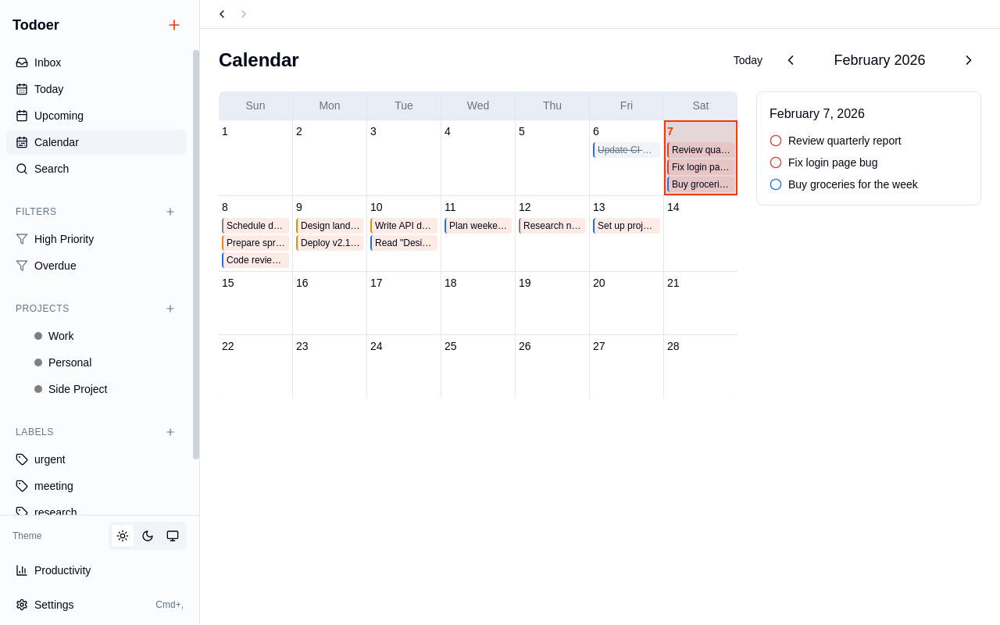

### Board View

Kanban-style project boards with task cards organized by sections. Drag and drop to reorder.

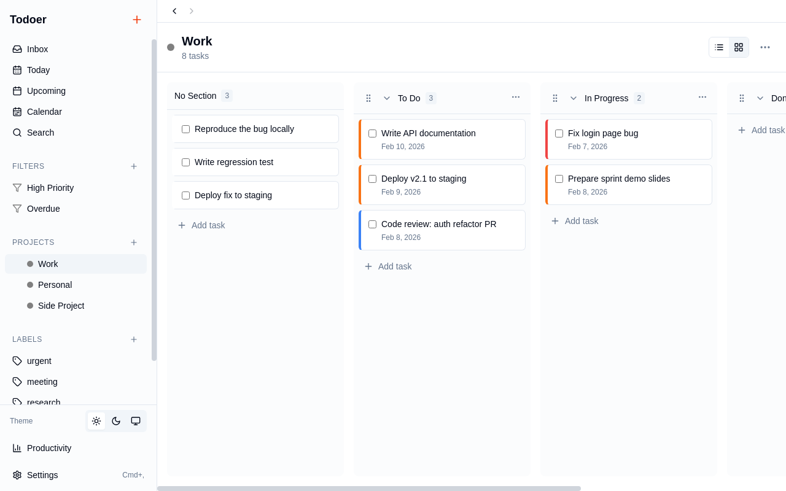

### Project List View

List view with sort and group controls. Switch between list and board with one click.


### Upcoming View

See all tasks grouped by day, stretching into the future.

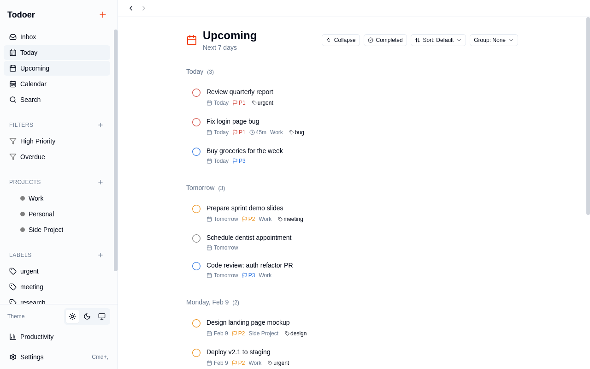

### Filters

Create saved filters using query syntax like `p1 | p2` or `overdue & @urgent`.

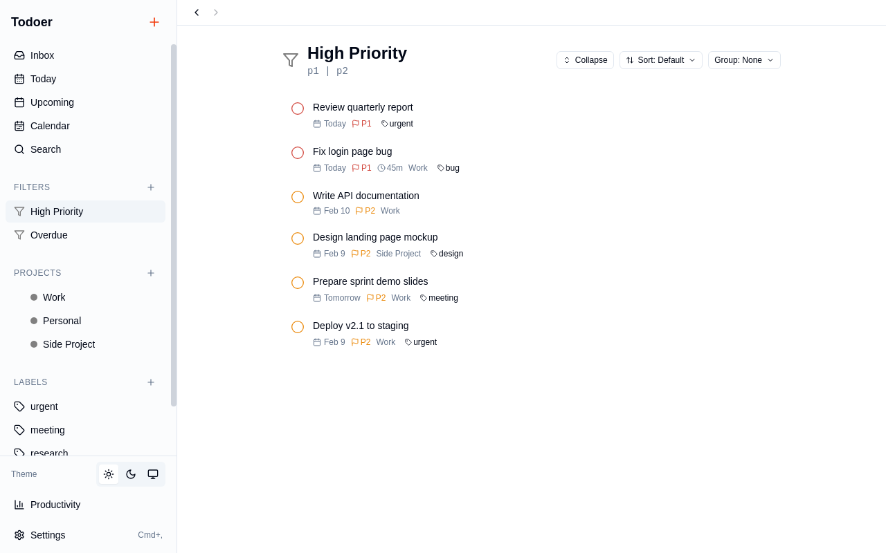

### Search

Full-text search across all tasks, with results showing project and label context.

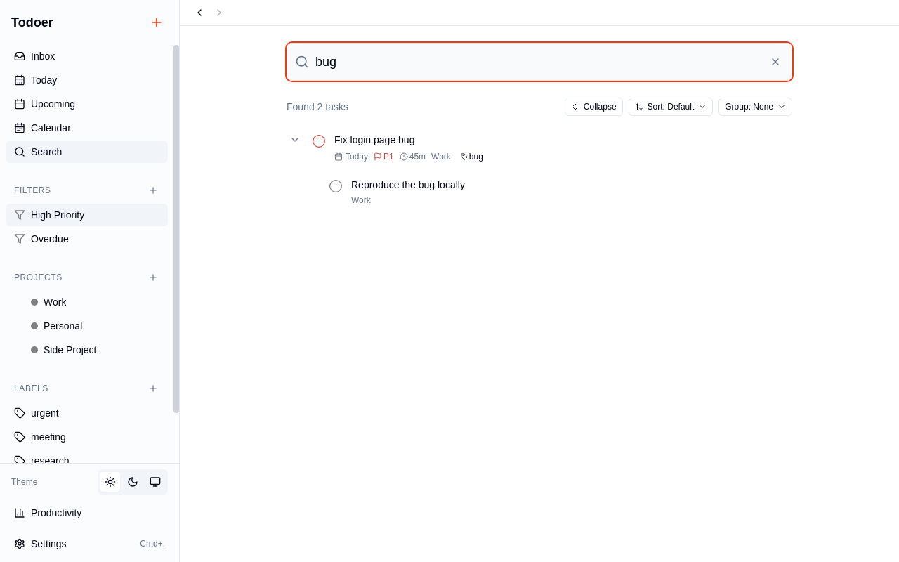

### Comments & Subtasks

Add comments to tasks for discussion and tracking. Break work into subtasks.

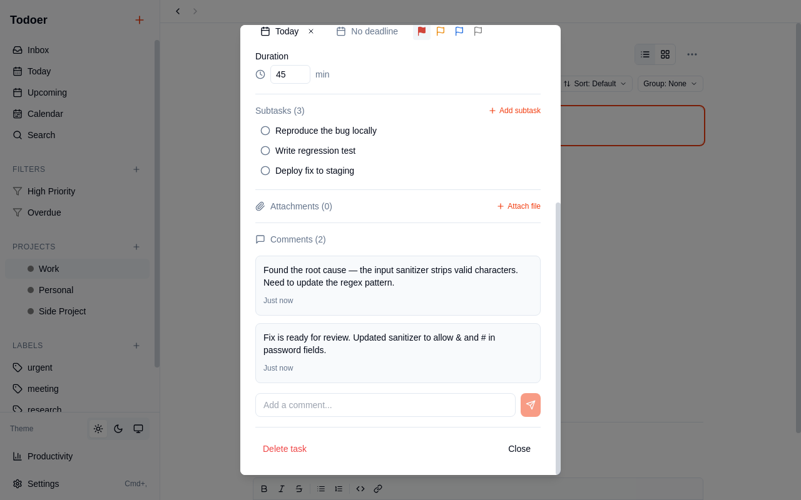

### Keyboard Shortcuts

30+ keyboard shortcuts for power users. Press <kbd>?</kbd> to see them all.

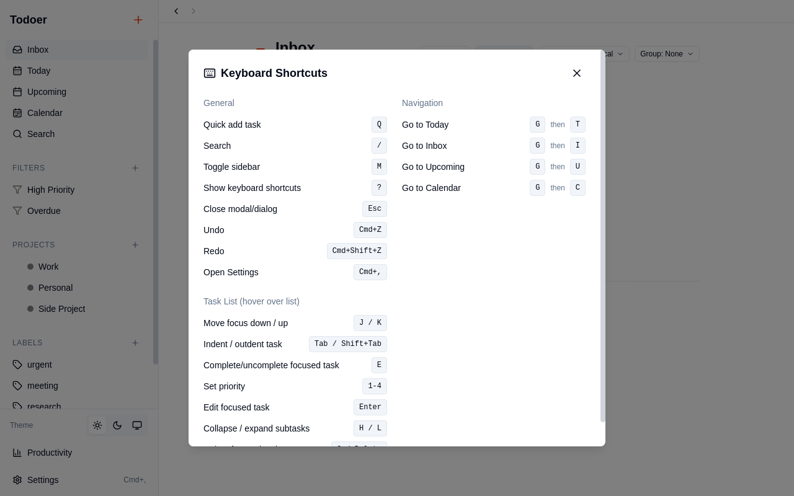

### Settings

Configure date format, time format, notifications, quiet hours, productivity goals, and more.

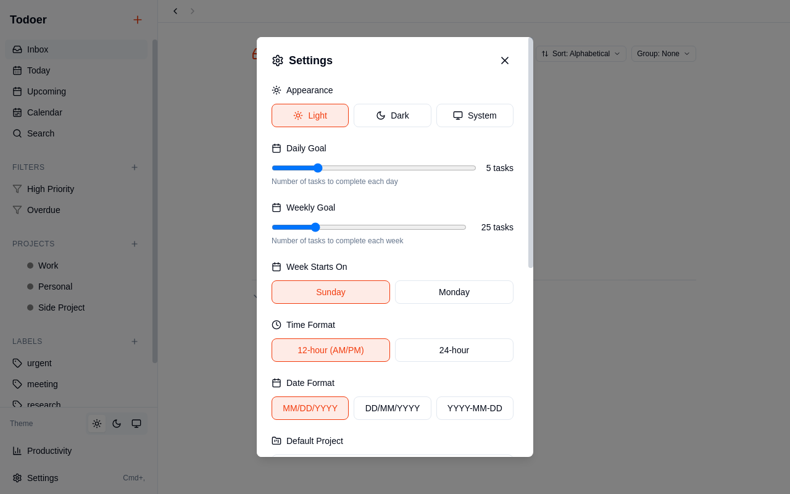

### Dark Mode

Full dark mode support with system theme detection.

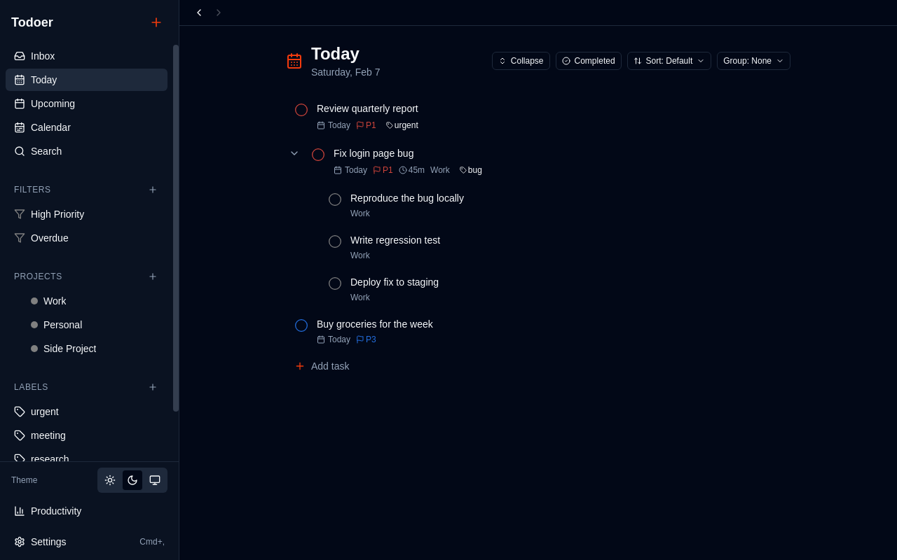

---

## Installation

### Build from Source

**Prerequisites:** Node.js 18+ and npm 8+

```bash
git clone https://github.com/hunterjackson/todoer.git
cd todoer
npm install
```

**Development:**

```bash
npm run dev
```

**Production build:**

```bash
# Build for current platform
npm run build

# Platform-specific
npm run build:linux
npm run build:mac
npm run build:win
```

Built applications are output to the `dist` directory.

---

## Quick Start

1. Launch Todoer
2. Press <kbd>Q</kbd> to quick-add your first task
3. Use inline syntax: `Buy groceries tomorrow #Personal @errands p2`
4. Press <kbd>G</kbd> then <kbd>T</kbd> to jump to Today view
5. Press <kbd>?</kbd> to see all keyboard shortcuts

---

## Inline Task Syntax

When adding tasks via Quick Add (<kbd>Q</kbd>), you can use inline modifiers:

| Syntax | Effect | Example |
|--------|--------|---------|
| `#project` | Assign to project | `Fix bug #Work` |
| `@label` | Add label | `Review PR @urgent` |
| `/section` | Assign to section | `New task /Backlog` |
| `p1`–`p4` | Set priority | `Deploy hotfix p1` |
| `for X min` | Set duration | `Team standup for 30 min` |

**Example:** `Review API design doc tomorrow #Work @urgent p1 for 60 min`

---

## Filter Query Syntax

Create custom filters using these operators:

| Query | Description |
|-------|-------------|
| `today` | Tasks due today |
| `tomorrow` | Tasks due tomorrow |
| `overdue` | Overdue tasks |
| `7 days` | Due within 7 days |
| `no date` | Tasks without a due date |
| `p1`, `p2`, `p3`, `p4` | Filter by priority |
| `#project` | Filter by project name |
| `@label` | Filter by label name |
| `search:text` | Search task content |
| `*` | Wildcard matching |
| `&` | AND — combine conditions |
| `\|` | OR — either condition |

**Examples:**
- `today & p1` — High priority tasks due today
- `p1 \| overdue` — P1 tasks or any overdue tasks
- `@urgent & #Work` — Urgent tasks in the Work project
- `no date & p1` — Unscheduled high priority tasks

---

## Keyboard Shortcuts

| Shortcut | Action |
|----------|--------|
| <kbd>Q</kbd> | Quick add task |
| <kbd>/</kbd> | Search |
| <kbd>M</kbd> | Toggle sidebar |
| <kbd>?</kbd> | Show keyboard shortcuts |
| <kbd>G</kbd> <kbd>T</kbd> | Go to Today |
| <kbd>G</kbd> <kbd>I</kbd> | Go to Inbox |
| <kbd>G</kbd> <kbd>U</kbd> | Go to Upcoming |
| <kbd>G</kbd> <kbd>C</kbd> | Go to Calendar |
| <kbd>J</kbd> / <kbd>K</kbd> | Move focus down / up |
| <kbd>E</kbd> | Complete / uncomplete task |
| <kbd>1</kbd>–<kbd>4</kbd> | Set priority |
| <kbd>Enter</kbd> | Edit focused task |
| <kbd>Tab</kbd> / <kbd>Shift+Tab</kbd> | Indent / outdent (subtask) |
| <kbd>H</kbd> / <kbd>L</kbd> | Collapse / expand subtasks |
| <kbd>Ctrl+Z</kbd> | Undo |
| <kbd>Ctrl+Shift+Z</kbd> | Redo |
| <kbd>Ctrl+,</kbd> | Settings |

---

## MCP Server Integration

Todoer includes an embedded [MCP](https://modelcontextprotocol.io/) server for AI assistant integration.

### Connecting to Claude Code

```bash
claude mcp add todoer -- /path/to/todoer --mcp
```

### Available Tools

| Tool | Description |
|------|-------------|
| `todoer_list_tasks` | List tasks with filters (today, upcoming, overdue, inbox, by project/label) |
| `todoer_create_task` | Create a task (supports NLP dates) |
| `todoer_complete_task` | Mark task as complete |
| `todoer_uncomplete_task` | Mark a completed task as incomplete |
| `todoer_update_task` | Update task properties |
| `todoer_delete_task` | Delete a task (soft delete) |
| `todoer_list_projects` | List all projects |
| `todoer_create_project` | Create a new project |
| `todoer_search` | Full-text search |
| `todoer_get_stats` | Get productivity statistics |

---

## Data Storage

Todoer stores data in a local SQLite database:

| OS | Default Location |
|----|------------------|
| Linux | `~/.config/todoer/todoer.db` |
| macOS | `~/Library/Application Support/todoer/todoer.db` |
| Windows | `%APPDATA%/todoer/todoer.db` |

To change the storage location, set the `TODOER_DATA_PATH` environment variable:

```bash
export TODOER_DATA_PATH=/path/to/your/data
```

To back up your data, copy the `todoer.db` file. It's a standard SQLite file.

---

## Development

### Scripts

| Command | Description |
|---------|-------------|
| `npm run dev` | Start in development mode with hot reload |
| `npm run build` | Build for production |
| `npm test` | Run unit and integration tests |
| `npm run test:watch` | Tests in watch mode |
| `npm run test:coverage` | Tests with coverage report |
| `npm run test:e2e` | Playwright E2E tests |

### Testing

The test suite includes:
- **Unit tests** for utilities, services, and repositories
- **Integration tests** for database operations
- **E2E tests** for user workflows using Playwright with Electron

### Project Structure

```
todoer/
├── src/
│   ├── main/           # Electron main process
│   │   ├── db/         # SQLite database & repositories
│   │   ├── mcp/        # MCP server implementation
│   │   ├── services/   # Business logic (date parsing, filters, reminders)
│   │   └── ipc/        # IPC handlers
│   ├── renderer/       # React UI
│   │   ├── components/ # UI components (views, task, sidebar, settings)
│   │   ├── hooks/      # React hooks
│   │   └── stores/     # Zustand state management
│   ├── shared/         # Shared types & utilities
│   └── preload/        # Electron preload scripts
├── tests/
│   ├── unit/           # Unit tests
│   ├── integration/    # Database integration tests
│   └── e2e/            # Playwright E2E tests
└── resources/          # App icons and assets
```

### Tech Stack

| Technology | Purpose |
|------------|---------|
| [Electron 29](https://www.electronjs.org/) | Desktop app framework |
| [React 18](https://react.dev/) | UI framework |
| [TypeScript 5](https://www.typescriptlang.org/) | Type safety |
| [sql.js](https://sql.js.org/) | SQLite in JavaScript (local-first storage) |
| [Vite](https://vitejs.dev/) | Build tool & dev server |
| [Tailwind CSS](https://tailwindcss.com/) | Styling |
| [Zustand](https://zustand-demo.pmnd.rs/) | State management |
| [Tiptap](https://tiptap.dev/) | Rich text editor |
| [dnd-kit](https://dndkit.com/) | Drag and drop |
| [chrono-node](https://github.com/wanasit/chrono) | Natural language date parsing |
| [rrule](https://github.com/jkbrzt/rrule) | Recurring task rules |
| [Vitest](https://vitest.dev/) | Unit & integration testing |
| [Playwright](https://playwright.dev/) | E2E testing |
| [MCP SDK](https://modelcontextprotocol.io/) | AI assistant integration |

---

## License

MIT
